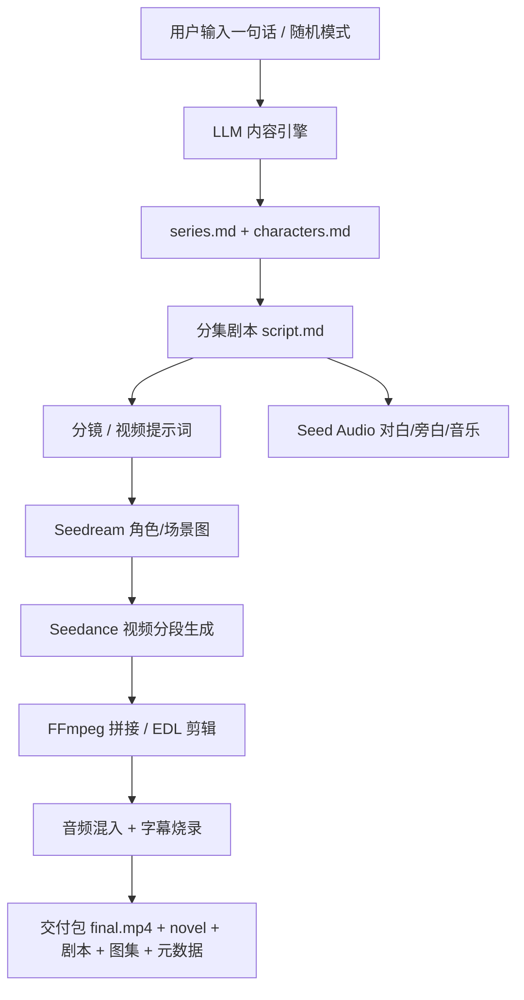

# 架构设计

## 总体流水线



## 模块划分

| 模块 | 目录 | 职责 |
| --- | --- | --- |
| 平台 API | `backend/app` | 用户/项目/任务/账单/交付 |
| 内容引擎 | `pipeline/prompts` + `backend/app/services` | LLM 生成系列/角色/剧本/分镜 |
| 视觉 | `services/images.py` | Seedream 角色/场景/封面图 |
| 视频 | `services/videos.py` | Seedance 提交/轮询/尾帧衔接 |
| 音频 | `services/audio.py` | Seed Audio 对白/旁白/音乐 |
| 后期 | `services/assembly.py` + `services/subtitles.py` | FFmpeg 拼接/混音/字幕 |
| 前端 | `frontend/` | 一键生成页、进度、交付 |
| 任务 | `workers/pipeline_runner.py` | 编排流水线各阶段 |

## 数据模型（初版）

- `User`：用户、密码哈希、余额（分）
- `Project`：一句话 idea、题材、集数、单集秒数、档位、状态、进度
- `Transaction`：计费流水（LLM token / 视频秒数）
- 阶段 1 后补充：`Series`（series.md）、`Character`（角色）、`Episode`（分集内容）

## 关键设计决策

1. **LLM 可插拔**：默认 mock 可完整跑通流程，接 key 后切换真实模型，便于开发和验收。
2. **媒体产物不入库**：视频/图片/音频是运行期产物，存 `backend/data/` 并由 git 忽略；代码与模板全在仓库。
3. **长视频连续性**：遵循 Seedance 技能约定——分段生成、每段返回尾帧作为下一段首帧，最终统一 EDL 剪辑后再重建音频时间轴，避免逐段音频断裂。
4. **音频即导演**：对白/音效/音乐按 Audio Director cue sheet 生成，字幕按最终成片对齐（不按分片），避免拼接漂移。
5. **成本透明**：每阶段记录 token/秒数消耗，交付时展示估算成本。

## 交付包结构

```text
project-<id>/
├── final.mp4            # 成片（含配音/音乐/字幕）
├── novel.md             # 完整小说
├── series.md            # 系列设定
├── characters.md        # 角色设定
├── characters/*.png     # 角色形象图
├── cover.png            # 封面
├── episodes/
│   └── ep001/
│       ├── script.md    # 剧本
│       └── video-prompts.md
└── metadata.json        # 标题/题材/时长/成本等
```

