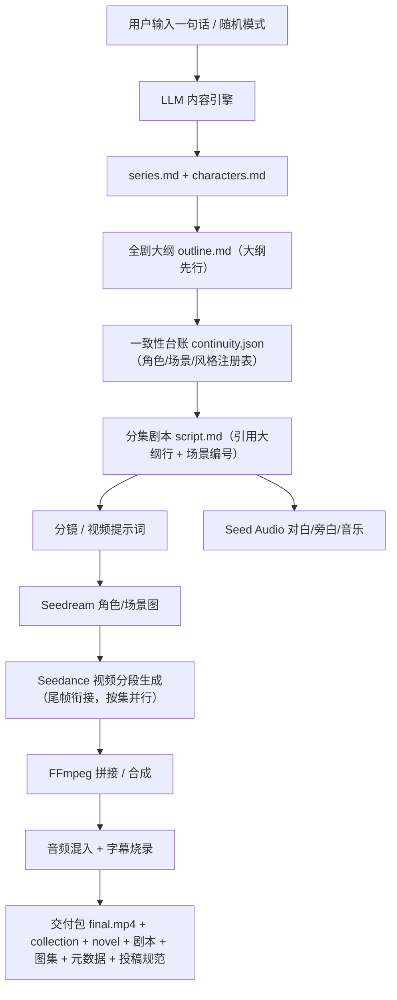

# 架构设计

## 总体流水线



## 模块划分

| 模块 | 目录 | 职责 |
| --- | --- | --- |
| 平台 API | `backend/app` | 用户/项目/任务/账单/交付 |
| 内容引擎 | `pipeline/prompts` + `backend/app/services` | LLM 生成系列/角色/大纲/台账/剧本/分镜 |
| 视觉 | `services/images.py` | Seedream 角色/场景/封面图 |
| 视频 | `services/videos.py` | Seedance 提交/轮询/尾帧衔接 |
| 音频 | `services/audio.py` | Seed Audio 对白/旁白/音乐 |
| 后期 | `services/assembly.py` + `services/subtitles.py` | FFmpeg 拼接/混音/字幕 |
| 前端 | `frontend/` | 一键生成页、模板库、SSE 进度、任务中心、交付 |
| 任务 | `workers/pipeline_runner.py` | 编排流水线（任务表/断点续跑/重试/预算） |
| 事件 | `services/events.py` | SSE 事件日志（events.jsonl） |
| 密钥 | `services/keys.py` + `routers/keys.py` | BYOK 加密存储与覆盖 |
| 资源预检 | `services/resource_query.py` | 火山资源包余额查询（V4 签名） |

## 数据模型

- `User`：用户、密码哈希、余额（分）
- `Project`：一句话 idea、题材、集数、单集秒数、档位、状态、进度
- `Task`：每集每步骤状态（pending/running/done/skipped/failed）、尝试次数、错误、成本
- `Transaction`：计费流水（注册赠送/充值/扣费/退款）
- `UserKey`：BYOK 用户自带密钥（Fernet 加密存储）
- 状态机：`pending → running → done | partial | failed`；`partial` = 部分集完成，可"继续生成"

## 关键设计决策

1. **LLM 可插拔 + BYOK**：默认 mock 可完整跑通流程；平台 Key 或用户自带 Key（按 provider 覆盖）均可。
2. **媒体产物不入库**：视频/图片/音频是运行期产物，存 `backend/data/` 并由 git 忽略；代码与模板全在仓库。
3. **长视频连续性**：分段生成、每段返回尾帧作为下一段首帧；角色/场景/风格一致性由 continuity.json 注册表统一约束，60 集不崩脸不换装。
4. **音频即导演**：对白/音效/音乐按 Audio Director cue sheet 生成，字幕按最终成片对齐（不按分片），避免拼接漂移。
5. **成本透明**：创建时按预估冻结，结束按实际消耗结算并退款差额；真实档生成前做火山资源包预检。
6. **断点续跑**：任务表持久化 + 产物存在性检查，服务重启自动恢复；每步失败指数退避重试 3 次，单集失败不拖垮整剧。
7. **长剧并行**：文本分集、视频/音频/合成按集并行（`llm_max_workers` 限制），集内串行保证尾帧衔接。
8. **实时进度**：流水线写 events.jsonl，`/api/projects/{id}/events` SSE 推送，前端断线自动重连。

## 交付包结构

```text
project-<id>/
├── final.mp4            # 成片（含配音/音乐/字幕）
├── novel.md             # 完整小说
├── series.md            # 系列设定
├── characters.md        # 角色设定
├── characters/*.png     # 角色形象图
├── cover.png            # 封面
├── episodes/
│   └── ep001/
│       ├── script.md    # 剧本
│       └── video-prompts.md
└── metadata.json        # 标题/题材/时长/成本等
```
